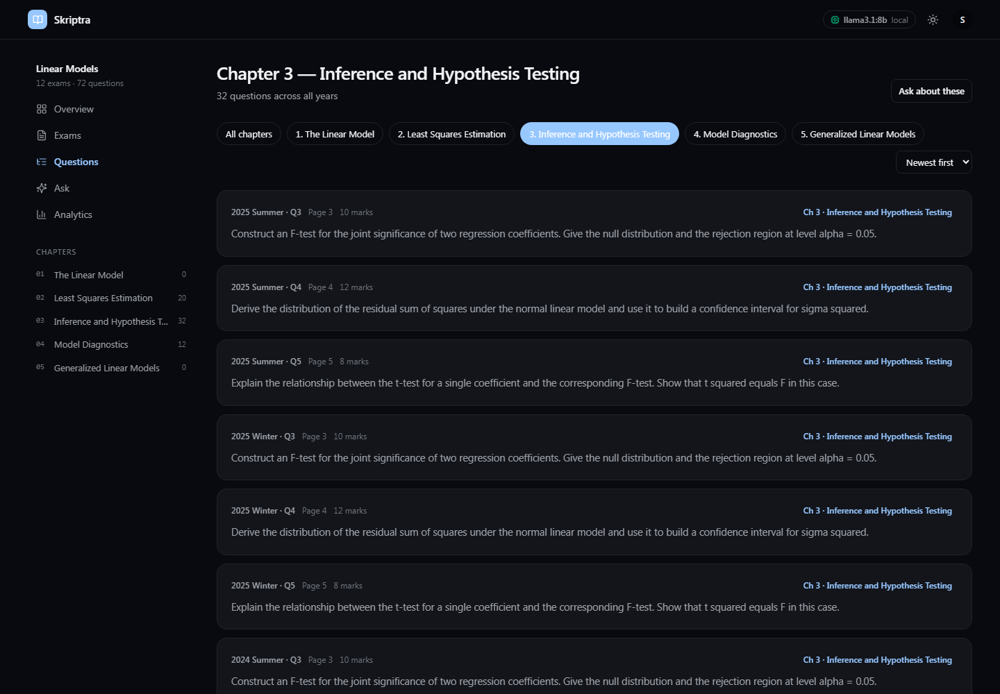
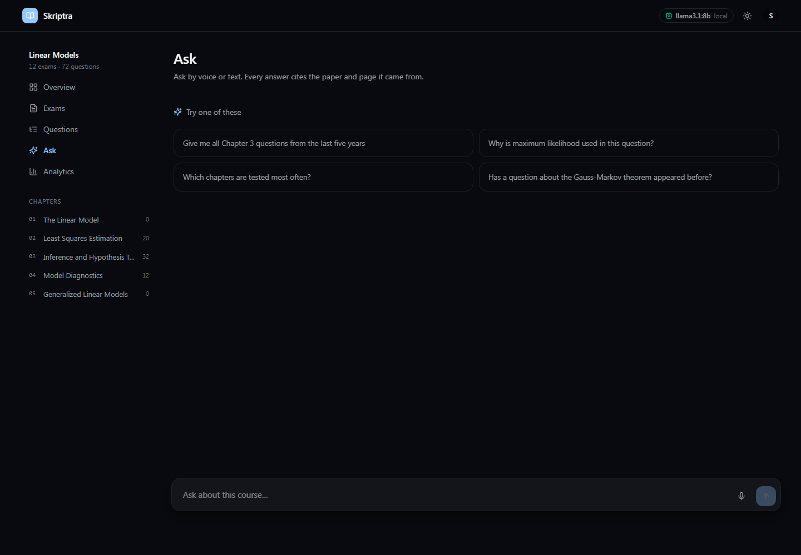
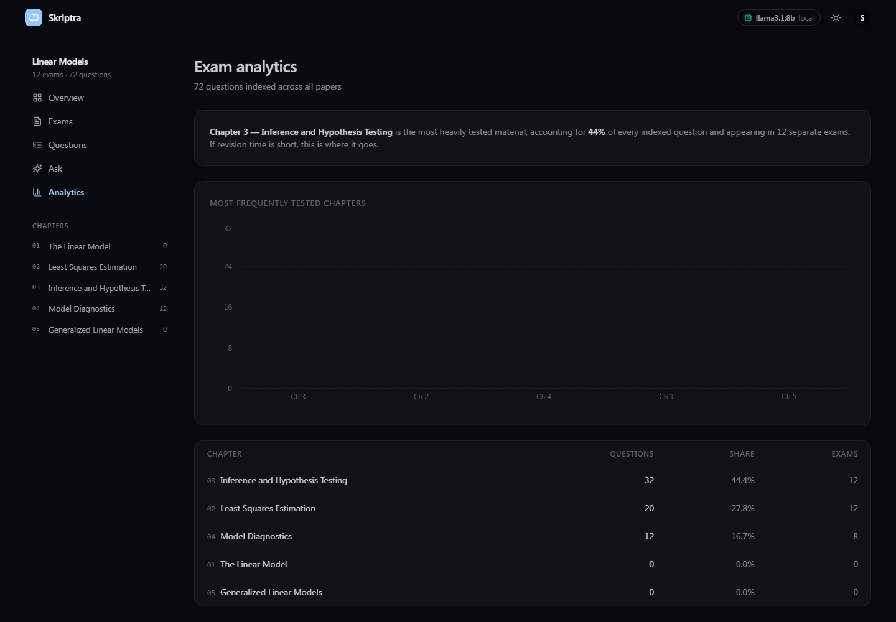
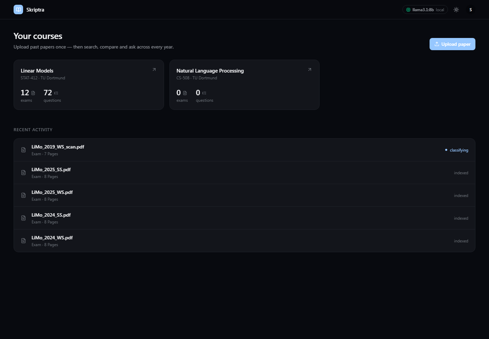
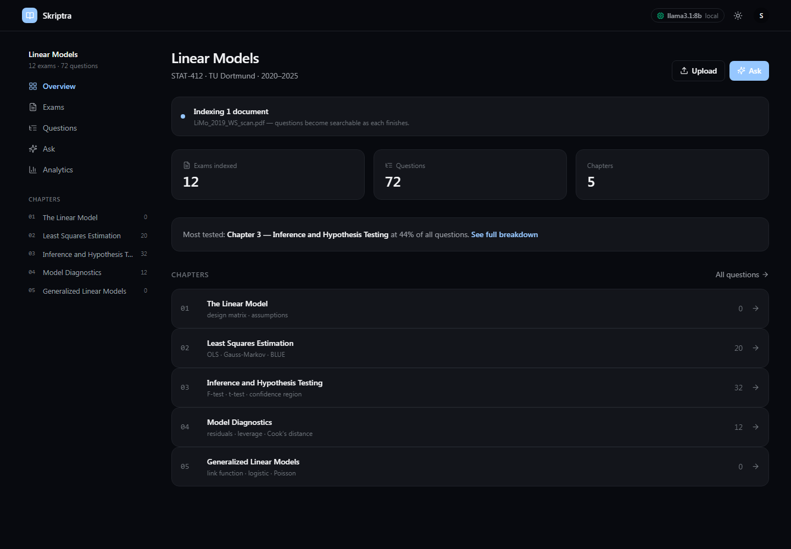

# Skriptra

**Intelligent Learning, Grounded in Knowledge.**

A self-hostable, provider-agnostic **exam intelligence platform**. Upload a course's past exam papers, solutions and lecture notes; then browse every question by chapter and year, find similar questions across years, and ask natural-language questions that are answered **with page-level citations back to the source PDF**.

It runs entirely on your own machine with a local model, or against any hosted provider. That choice is a single environment variable.

`Go 1.26` · `React 18 + TypeScript` · `PostgreSQL 17 + pgvector` · `NATS` · `Docker`

> **Status — in active development.** The API, retrieval and interface are built and running against a real database. The document ingestion pipeline is in progress, so the screenshots below use a seeded corpus.
> **A hosted demo is coming.** Until then the whole stack runs locally with `docker compose up` — see [Running it locally](#running-it-locally).

---

## The product

<p align="center">
  
</p>

<p align="center"><em>Chapter filtering — an exhaustive list, not a top-k sample.</em></p>

| | |
|:--:|:--:|
|  |  |
| **Ask** — by voice or text, answered with citations | **Analytics** — computed in SQL, so the figures are exact |
|  |  |
| **Dashboard** — courses, with live ingestion status | **Course** — chapters as the primary navigation |

Screenshots are generated from the running application by [`dev/screenshots.ps1`](dev/screenshots.ps1), so they cannot quietly go stale.

---

## Why it exists

At many German universities — including TU Dortmund — getting hold of past exam papers (*Altklausuren*) still means paying a small fee at the library, borrowing physical copies, and returning them. Students then have no way to ask the obvious questions: *which chapters actually get tested?* *Has this question appeared before?* *Show me every Chapter 3 question from the last five years.*

Skriptra answers those questions.

---

## What makes it different from "chat with your PDF"

Three things, and they are the engineering substance of the project:

1. **Chapter resolution.** "Give me the Chapter 2 questions" is not a similarity search — nothing in an exam question says "Chapter 2". Skriptra builds a chapter taxonomy from the course syllabus or textbook table of contents, classifies every extracted question against it at ingest time, and resolves chapter references in queries into **metadata filters**.

2. **A query router.** "Give me *all* Chapter 3 questions" is an aggregation query, and top-k retrieval structurally cannot answer it. Skriptra routes enumerate/aggregate queries to SQL over the extracted `questions` table, and explain/compare queries to hybrid vector retrieval — and combines both when a query needs it.

3. **An evaluation harness.** A golden dataset of real question/answer pairs, retrieval metrics (recall@k, MRR) and answer metrics (groundedness, citation accuracy), run in CI so a prompt or chunking change that regresses retrieval **fails the build**.

---

## Architecture

```
                    Web (React)            Flutter (later)
                         |                       |
                         +-----------+-----------+
                                     |
                              Go API  (/api/v1)
                                     |
        +----------------+-----------+-----------+----------------+
        |                |                       |                |
   PostgreSQL          NATS                  AI Provider      Redis
   + pgvector            |                   (interface)
                    Ingest workers               |
                         |                +------+------+
                  PDF text + page map      |             |
                  extraction (go-fitz)    LLM        Embeddings
                                           |             |
                                     local/hosted  local/hosted
```

**The entire backend is Go.** Embeddings and generation are HTTP calls, vector
search is SQL, and PDF text extraction with page coordinates is a Go library —
so no Python is needed. OCR and layout analysis are the only components that
genuinely require it, and both are phase 2. See
[`docs/00-DESIGN.md`](docs/00-DESIGN.md) §4.2.

The application only ever depends on the `LLM`, `Embedder` and `VectorStore` interfaces. Configuration decides the implementation — there is no `if production` branching anywhere in the codebase.

## Stack

| Layer | Choice |
|---|---|
| API / orchestration / workers | Go (Gin, gRPC) |
| Document processing | Go (`go-fitz` — text with page coordinates) |
| Storage / retrieval | PostgreSQL + pgvector (hybrid vector + keyword in one query) |
| Messaging | NATS |
| Cache | Redis |
| Frontend | React + TypeScript + Vite + Tailwind + shadcn/ui |
| Models | Ollama (local) or any hosted provider, selected by config |
| Ops | Docker Compose, GitHub Actions, OpenTelemetry + Grafana |

Full rationale — including why pgvector rather than a dedicated vector database — is in [`docs/00-DESIGN.md`](docs/00-DESIGN.md).

---

## Running it locally

Requires Docker. Node is not needed on the host — the web service runs in a container.

```bash
cp .env.example .env.local
docker compose up
```

That gives you the frontend on `:5173`, the Go API on `:8080`, workers, PostgreSQL with pgvector, and NATS. Add `--profile local-llm` to include Ollama and run the whole system with **no external API calls and no API keys** — nothing leaves the machine.

To load the sample corpus used in the screenshots:

```bash
docker compose exec -T postgres psql -U skriptra -d skriptra < dev/seed.sql
```

---

## Project status

| Area | State |
|---|---|
| API contract (`/api/v1`, frozen) | Done |
| Schema and migrations | Done — verified on PostgreSQL 17 + pgvector |
| Retrieval (hybrid, RRF, filtered) | Done — all four query intents verified against a live database |
| Go API, query router, providers | Done |
| Web interface | Done |
| **Document ingestion pipeline** | **In progress** |
| Evaluation harness | Planned |
| Hosted demo, CI/CD | Planned |

See [`PROGRESS.md`](PROGRESS.md) for detail and the current next step.

## A note on exam papers

Universities generally hold the rights to their exam papers. This repository contains **no exam content** — the sample corpus in `dev/seed.sql` is written for the purpose. Skriptra is built to be self-hosted precisely so a course's material stays on the institution's or the student's own infrastructure.

## License

MIT
