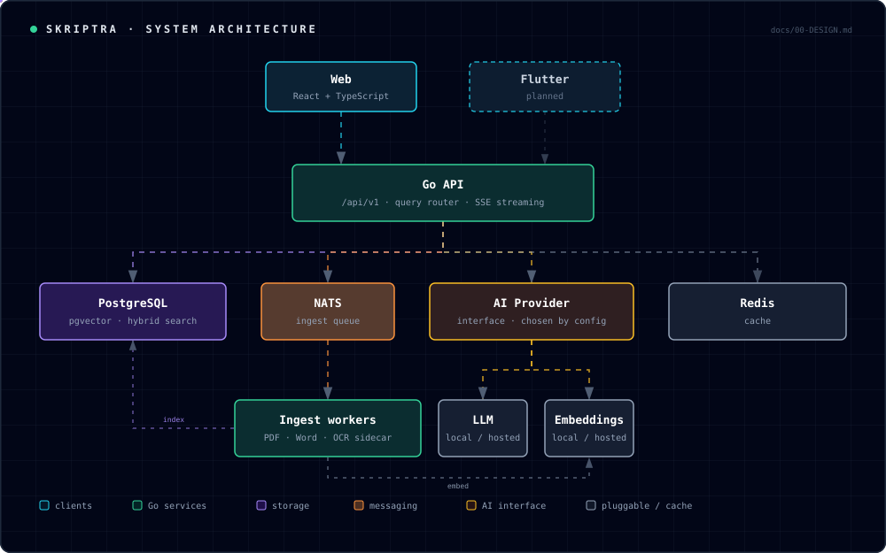

# Skriptra

**Intelligent Learning, Grounded in Knowledge.**

A self-hostable, provider-agnostic **exam intelligence platform**. Upload a course's past exam papers, solutions and lecture notes; then browse every question by chapter and year, find similar questions across years, and ask natural-language questions that are answered **with page-level citations back to the source PDF**.

It runs entirely on your own machine with a local model, or against any hosted provider. That choice is a single environment variable.

`Go 1.26` · `Python` · `React 18 + TypeScript` · `PostgreSQL 17 + pgvector` · `NATS` · `Docker`

> **Status: in active development.** The full loop works. A PDF uploads, is split into questions, classified by chapter, embedded and indexed, and is then retrievable by meaning with page-level citations. Screenshots below use a seeded corpus so they stay reproducible.
> **A hosted demo is coming.** Until then the whole stack runs locally with `docker compose up`. See [Running it locally](#running-it-locally).

---

## The product

<p align="center">
  
</p>

<p align="center"><em>Chapter filtering: an exhaustive list, not a top-k sample.</em></p>

| | |
|:--:|:--:|
|  |  |
| **Ask**: by voice or text, answered with citations | **Analytics**: computed in SQL, so the figures are exact |
|  |  |
| **Dashboard**: courses, with live ingestion status | **Course**: chapters as the primary navigation |

Screenshots are generated from the running application by [`dev/screenshots.ps1`](dev/screenshots.ps1), so they cannot quietly go stale.

---

## Why it exists

At many German universities, including TU Dortmund, getting hold of past exam papers (*Altklausuren*) still means paying a small fee at the library, borrowing physical copies, and returning them. Students then have no way to ask the obvious questions: *which chapters actually get tested?* *Has this question appeared before?* *Show me every Chapter 3 question from the last five years.*

Skriptra answers those questions.

---

## What makes it different from "chat with your PDF"

Three things, and they are the engineering substance of the project:

1. **Chapter resolution.** "Give me the Chapter 2 questions" is not a similarity search. Nothing in an exam question says "Chapter 2". Skriptra builds a chapter taxonomy from the course syllabus or textbook table of contents, classifies every extracted question against it at ingest time, and resolves chapter references in queries into **metadata filters**.

2. **A query router.** "Give me *all* Chapter 3 questions" is an aggregation query, and top-k retrieval structurally cannot answer it. Skriptra routes enumerate and aggregate queries to SQL over the extracted `questions` table, sends explain and compare queries to hybrid vector retrieval, and combines both when a query needs it.

3. **An evaluation harness.** A golden dataset of hand-written cases, retrieval metrics (recall@k, MRR) and behavioural ones (intent accuracy, refusal correctness), with a runner that exits non-zero against a committed baseline. The intent is that a prompt or chunking change which regresses retrieval **fails the build**. It is built and the CI job is written, but the baseline has not been recorded yet, so the gate is not live. See [Project status](#project-status).

---

## Architecture

<p align="center">
  
</p>

**The backend is Go, apart from one service.** Embeddings and generation are
HTTP calls, retrieval is SQL, and text extraction from PDFs and Word documents
is a Go library, so none of that needs Python.

Reading text off a **photograph** does. Tesseract has no Go equivalent worth
using, so OCR is a small Python sidecar, and it is the only non-Go component in
the project. It plugs in behind a `DocumentParser` interface: each parser
declares what it can do, and a chain picks the cheapest one that can handle a
given document. A digital PDF never reaches the sidecar; a photo always does.
Polyglot by necessity, not by default. See [`docs/00-DESIGN.md`](docs/00-DESIGN.md) §4.2.

The application only ever depends on the `LLM`, `Embedder`, `VectorStore` and `DocumentParser` interfaces. Configuration decides the implementation. There is no `if production` branching anywhere in the codebase.

## Stack

| Layer | Choice |
|---|---|
| API / orchestration / workers | Go (Gin) |
| PDF and Word extraction | Go (`ledongthuc/pdf`, plus `archive/zip` for `.docx`) |
| OCR for photos and scans | Python sidecar (FastAPI, Tesseract, `eng+deu`) |
| Storage / retrieval | PostgreSQL + pgvector (hybrid vector + keyword in one query) |
| Messaging | NATS JetStream |
| Cache | Redis (embeddings and analytics; optional) |
| Frontend | React + TypeScript + Vite + Tailwind |
| Models | Ollama (local) or any OpenAI-compatible provider, selected by config |
| Ops | Docker Compose, GitHub Actions |

PDF extraction is pure Go rather than a MuPDF binding, so the binary builds
anywhere Go builds with no C toolchain. Full rationale, including why pgvector
rather than a dedicated vector database, is in
[`docs/00-DESIGN.md`](docs/00-DESIGN.md).

## What it accepts

| Input | Handled by |
|---|---|
| PDF with a text layer | Go, in process |
| Word (`.docx`) | Go, in process |
| Photo or camera capture (JPEG, PNG, HEIC, TIFF) | OCR sidecar |
| Scanned PDF (no text layer) | OCR sidecar |

Format is detected from file contents, not the extension, so a photo saved as
`scan.pdf` still routes to OCR. With the sidecar not running, those uploads are
refused with a message naming the missing capability rather than accepted and
indexed as nothing.

---

## Running it locally

Requires Docker. Node and Go are not needed on the host; everything runs in containers.

```bash
cp .env.example .env.local
docker compose --profile ocr --profile local-llm up -d
```

That gives you the frontend on `:5173`, the Go API on `:8080`, the ingest
worker, PostgreSQL with pgvector, NATS, Redis, the OCR sidecar, and Ollama.

Then pull the two models. Both run locally, so from here the system makes **no
external API calls and needs no API keys**:

```bash
docker compose exec ollama ollama pull llama3.2:3b
docker compose exec ollama ollama pull nomic-embed-text
```

Load the sample corpus used in the screenshots:

```bash
docker compose exec -T postgres psql -U skriptra -d skriptra < dev/seed.sql
```

Open http://localhost:5173.

### Smaller footprints

Both extras are behind profiles, because each is a large download that is
pointless for some corpora:

```bash
docker compose up -d                       # no OCR, no local model
docker compose --profile ocr up -d         # + OCR, for photos and scans
docker compose --profile local-llm up -d   # + Ollama
```

Without `ocr`, digital PDFs and Word files work and photos are refused with a
clear message. Without `local-llm`, point at a model you already run:

```bash
# in .env.local
LLM_BASE_URL=http://host.docker.internal:11434
EMBEDDING_BASE_URL=http://host.docker.internal:11434
```

or at any OpenAI-compatible endpoint, which is one variable:

```bash
LLM_PROVIDER=openai-compatible
LLM_BASE_URL=https://your-host/v1
LLM_API_KEY=...
```

---

## Project status

| Area | State |
|---|---|
| API contract (`/api/v1`, frozen) | Done |
| Schema and migrations | Done, verified on PostgreSQL 17 + pgvector, including rollback |
| Retrieval (hybrid, RRF, filtered) | Done, all four query intents verified against a live database |
| Go API, query router, providers | Done |
| Web interface, upload, voice input | Done |
| Ingestion: PDF, Word, photos via OCR | Done, verified end to end from a clean `docker compose up`, including a photograph reaching `indexed` |
| Redis caching | Done, embeddings and analytics, invalidated on ingest |
| CI | Build, vet and race tests, migrations up then down then up, frontend typecheck and build |
| **Evaluation harness** | **Built but not yet run.** 16 golden cases and a regression gate exist; the baseline is unrecorded, so nothing fails CI on a quality regression yet |
| Chapter classification accuracy | Keyword path works and is tested. The LLM fallback for ambiguous questions is written but unmeasured |
| Observability (OpenTelemetry, dashboards) | Not started. `OTEL_EXPORTER_OTLP_ENDPOINT` is read by config but nothing emits spans |
| Auth beyond a single-user stub | Not started, though authorization checks are wired at every endpoint |
| Hosted demo | Planned |

See [`PROGRESS.md`](PROGRESS.md) for detail and the current next step.

## A note on exam papers

Universities generally hold the rights to their exam papers. This repository contains **no exam content**. The sample corpus in `dev/seed.sql` is written for the purpose. Skriptra is built to be self-hosted precisely so a course's material stays on the institution's or the student's own infrastructure.

## License

MIT
